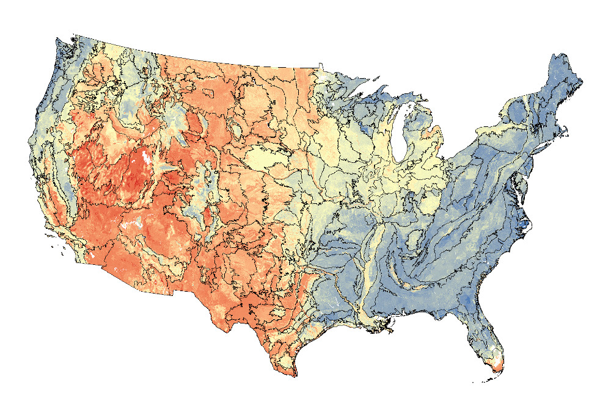

# ISSR-800
Intermediate Scale Soil Rasters prepared on an 800m grid, from FY2017 SSURGO and STATSGO data.

## Draft Proposal
**Intermediate-scale gridded soil property and interpretation maps from averaged and aggregated SSURGO and STATSGO data.**

Dylan Beaudette - Digital Soil Mapping Specialist, NRCS Region 2
Tom D’Avello - Soil Scientist/GIS Specialist, NSSC-Geospatial Research Unit 
Whityn Owen - GIS Specialist, NRCS Oregon
Jennifer Wood - Soil Data Quality Specialist, NRCS Region 
Dylan Beaudette - Digital Soil Mapping Specialist, NRCS Region 2
Stephen Roecker - Soil Data Quality Specialist/GIS Specialist, NRCS Region 11
Tom D’Avello - Soil Scientist/GIS Specialist, NSSC-Geospatial Research Unit
Jason Nemecek - State Soil Scientist, Wisconsin

There are not many “intermediate-scale” soil survey products available for the evaluation of MLRA concepts, development of LRU concepts, and regional to continental scale modeling projects. SSURGO is often too detailed, not spatially complete, and STATSGO is often too coarse and not well aligned with recent developments in soil survey.

SSD staff recently developed a set of 800m resolution maps of 40 commonly used soil physical, chemical, and interpretive parameters. We propose that these maps function as part of a new suite of intermediate-scale, gridded products (100m, 200m, 400m, 800m), filling an important void for “official” USDA-NRCS raster soil survey data.

The maps are generated using vector-based aggregation of the latest SSURGO database, with NOTCOM regions filled using the latest STATSGO database. The resulting maps are suitable for scales between (order 4) SSURGO and STATSGO. Conveniently sized (typically between 10–100MB each), these maps can be accessed instantly, even across network shares, and integrate seamlessly with existing raster-based analytical tools. Currently, the maps are for CONUS only, however, companion maps for HI and AK are planned. The 800m grid was selected to facilitate integration with the widely used PRISM climate data.

Rationale here for why property maps, derived from SSURGO values averaged or aggregated across components in a map unit, are appropriate for delivering as soil property data for the public.  Does the method of deconstructing the original map unit/soil-landscape concept deliver useful information to the public?  How do we know it is “correct”? How do we communicate a measure of certainty or uncertainty about the data to the public if the original data doesn’t have this kind of attribution? Is the original correlation and certification process an acceptable level of validation for the use of the data?

## Related Products
   * [CONUS-SOIL](http://www.soilinfo.psu.edu/index.cgi?soil_data&conus&data_cov&texture&image)
   * [Soils Database for Wind Erosion/Windblown Dust](http://www.lar.wsu.edu/nw-airquest/soils_database.html) [publication](http://www.jswconline.org/content/64/6/363.refs)
